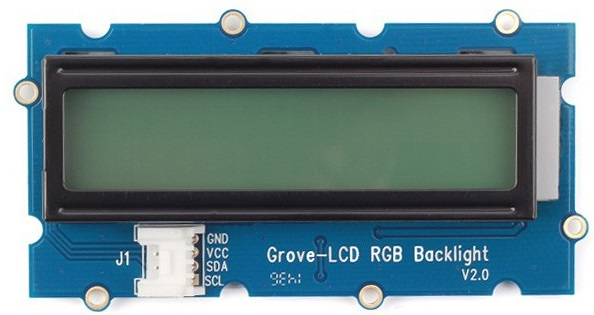
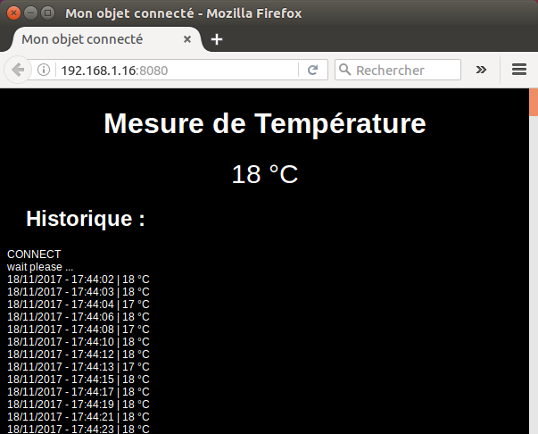

# Mesure de distance 

La mesure s'effectue au moyen d'un capteur us ping de chez Parallax et l'affichage est réalisé sur écran LCD RGB i2c 16x2 sur une Raspberry.

# L'afficheur

# le capteur us ping
# L'afficheur

# cross-compilation
arm-unknown-linux-gnueabihf-g++ C18B20.cpp ci2c.cpp rgb_lcd.cpp main.cpp -o iot -pthread -std=c++11

# Utilisation avec websocketd
./websocketd --port=8080 --staticdir=. ./iot

Dans un navigateur : http://ip_raspberry:8080

